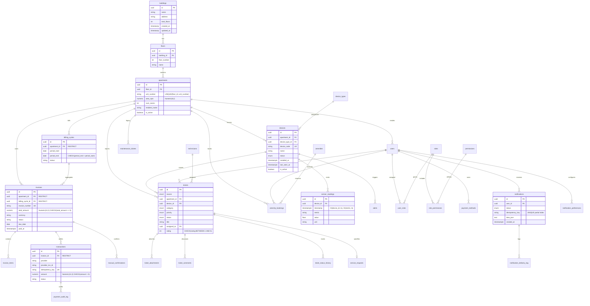

# Production Database Design — Smart Building Cloud Platform

> **Version**: 2.0.0  
> **Status**: Approved & Remediated  
> **Database Engine**: PostgreSQL 16+  
> **Target Environment**: Docker / Kubernetes / Cloud (AWS RDS / GCP Cloud SQL / Bare Metal)

---

## 1. Executive Summary & Target Architecture

The **Smart Building Cloud Platform** requires a resilient, high-throughput, and observable database architecture capable of supporting:
1. **High-Frequency Ingestion**: Up to 10,000+ telemetry readings/second from IoT sensors across apartments and communal facilities without saturating connection pools or locking tables.
2. **Financial Precision**: Absolute mathematical accuracy for billing cycles, utility consumption calculations (electricity, water, HVAC), invoices, and payment audits (`Numeric` types, strict CHECK constraints, RESTRICT foreign keys).
3. **Multi-Tenant / Multi-Building Scoping**: Granular RBAC supporting System Admins, Property Managers, Technicians, and Residents with building-level isolation.
4. **Resilience & Zero-Loss Recovery**: Point-in-Time Recovery (PITR) via pgBackRest, streaming replication with automated failover, and PgBouncer connection pooling.

### 1.1 Data Tier Topology

```text
                      [ React Web UI / Mobile App / IoT Gateways ]
                                           │
                                           ▼
                                 [ Envoy / Ingress ]
                                           │
                        ┌──────────────────┴──────────────────┐
                        ▼                                     ▼
             [ FastAPI Services ]                   [ IoT Kafka Ingestion ]
                        │                                     │
                        │ (App Queries)                       │ (Batch Workers)
                        ▼                                     ▼
               [ PgBouncer Pooler ]                  [ Consumer Bulk Loader ]
             (Transaction Pooling)                   (COPY / Chunked Inserts)
                        │                                     │
         ┌──────────────┴──────────────┐                      │
         ▼                             ▼                      ▼
  [ HAProxy / Keepalived ]      [ Redis Cluster ]    [ PostgreSQL Primary ]
         │ (Read/Write Split)   (Cache / Sessions)            │
         ├─────────────────────────────┬──────────────────────┘
         ▼                             ▼
  ┌──────────────┐              ┌──────────────┐
  │  PostgreSQL  │  Streaming   │  PostgreSQL  │
  │   Primary    ├─────────────►│ Read Replica │
  └──────┬───────┘  Replication └──────────────┘
         │
         │ WAL Archiving
         ▼
  ┌──────────────┐
  │  pgBackRest  ├─────────────► [ MinIO / S3 Object Storage ]
  └──────────────┘               (Encrypted Backups + WALs)
```

---

## 2. Complete Entity Domain Architecture

The database is partitioned into 9 cohesive bounded contexts:

| Domain | Key Entities | Primary Access Pattern | Consistency Requirement |
|---|---|---|---|
| **Core Building** | `buildings`, `floors`, `apartments` | Read-heavy, hierarchical navigation | Strong, CASCADE deletes down tree |
| **IoT Telemetry** | `device_types`, `devices`, `sensor_readings`, `energy_consumption`, `water_consumption` | Write-intensive append-only time-series | Eventual consistency via Kafka, BRIN/B-tree indexed |
| **Anomaly & Alerts**| `alerts` | Event-triggered, dashboard filtering | Strong, indexed on status & time |
| **Identity & RBAC** | `users`, `roles`, `permissions`, `user_roles`, `role_permissions` | Read-heavy, token validation caching | Strong, composite keys, building-scoped |
| **Billing & Payments**| `billing_rates`, `late_fee_policies`, `billing_cycles`, `invoices`, `invoice_items`, `payment_methods`, `transactions`, `payment_audit_log`, `manual_confirmations` | Financial transactions, audit compliance | Strict ACID, RESTRICT FKs, Decimal precision, idempotency |
| **Work Orders** | `technicians`, `tickets`, `ticket_attachments`, `ticket_comments`, `ticket_status_history`, `service_requests`, `maintenance_tickets` (legacy) | State machine workflows, SLA tracking | Strong, append-only history audit |
| **Community** | `amenities`, `amenity_bookings`, `announcements` | Booking slots, anti-double-booking | Strong concurrency control via SELECT FOR UPDATE |
| **Notifications** | `notification_templates`, `notification_preferences`, `notifications`, `notification_delivery_log` | High-volume dispatch, deduplication | Partial unique idempotency keys |
| **Batch & Exports** | `bulk_jobs`, `report_exports` | Asynchronous worker progress tracking | Strong, status state machine |

---

## 3. Comprehensive Entity-Relationship Diagram (ERD)



---

## 4. Production Engineering Implementations

### 4.1 Idempotency & Deduplication Strategy
1. **API Payment Idempotency**:
   - `transactions.idempotency_key` is enforced via `UNIQUE` constraint. Duplicate payment requests with the same idempotency key are rejected or return the cached transaction response without re-executing credit charges.
2. **Notification Dispatch Idempotency**:
   - `notifications.idempotency_key` enforces unique event dispatch per channel/user via a partial index:
     ```sql
     CREATE UNIQUE INDEX ix_notifications_idempotency_key 
     ON notifications (idempotency_key) 
     WHERE idempotency_key IS NOT NULL;
     ```
3. **Kafka Sensor Ingestion Deduplication**:
   - Ingestion batches calculate an event hash `hash(device_id, timestamp, metric)` or use UUIDv5 derived from the payload to avoid duplicate readings when Kafka consumers replay from uncommitted offsets.

### 4.2 Concurrency & Financial Locking
1. **Pessimistic Row-Level Locking (`SELECT FOR UPDATE`)**:
   - When generating invoices, calculating late fees, or finalizing transactions, the application locks the target invoice/booking:
     ```python
     stmt = (
         select(Invoice)
         .where(Invoice.id == invoice_id)
         .with_for_update()
     )
     ```
2. **Temporal Integrity Constraints**:
   - `billing_cycles` enforces `period_end > period_start` at the database engine level via `CheckConstraint`.
   - Amenity booking slot collisions are prevented by checking overlapping ranges:
     ```sql
     -- Prevent overlapping bookings for same amenity
     EXCLUDE USING gist (
         amenity_id WITH =,
         tstzrange(start_time, end_time) WITH &&
     ) WHERE (status != 'cancelled');
     ```

### 4.3 Audit Trail & Compliance Architecture
1. **Append-Only Immutable Logs**:
   - `payment_audit_log`: Logs every state change of a payment transaction (`initiated`, `processing`, `success`, `failed`, `refunded`) with payload snapshot, actor, and client IP. Rows are strictly append-only (no `UPDATE` or `DELETE` permitted for application roles).
   - `ticket_status_history`: Captures full state transitions (`from_status`, `to_status`, `changed_by`, `duration_seconds`) ensuring SLA auditability.
2. **Server-Side Timestamp Truth**:
   - All audit fields use database-evaluated defaults:
     ```sql
     created_at TIMESTAMPTZ NOT NULL DEFAULT clock_timestamp()
     ```
   - Python-side timestamp generation (`datetime.utcnow`) has been completely eradicated to avoid client clock skew.

### 4.4 Data Retention & Partitioning Strategy

`sensor_readings` generates the highest ingestion volume (~8.6 million rows per day at 500 active devices with 5s polling intervals).

#### Recommended Partitioning: PostgreSQL Declarative Range Partitioning
- **Partition Key**: `timestamp` (Monthly chunks).
- **Partition Table Template**:
  ```sql
  CREATE TABLE sensor_readings (
      id UUID NOT NULL,
      device_id UUID NOT NULL,
      timestamp TIMESTAMPTZ NOT NULL,
      metric VARCHAR(50) NOT NULL,
      value DOUBLE PRECISION NOT NULL,
      unit VARCHAR(20) NOT NULL,
      created_at TIMESTAMPTZ NOT NULL DEFAULT clock_timestamp(),
      PRIMARY KEY (timestamp, id),
      FOREIGN KEY (device_id) REFERENCES devices(id) ON DELETE CASCADE
  ) PARTITION BY RANGE (timestamp);

  -- Monthly partition example:
  CREATE TABLE sensor_readings_2026_09 PARTITION OF sensor_readings
      FOR VALUES FROM ('2026-09-01 00:00:00+00') TO ('2026-10-01 00:00:00+00');
  ```
- **Lifecycle & Retention**:
  - Partitions older than 90 days are detached and migrated to cold columnar storage (Parquet in MinIO/S3) or compressed via TimescaleDB compression.
  - Aggregated summaries are retained permanently in `energy_consumption` and `water_consumption` tables.

---

## 5. Indexing & Query Optimization Matrix

| Table | Index Name | Columns | Index Type | Query Optimization Target |
|---|---|---|---|---|
| `apartments` | `uq_apartments_floor_unit` | `(floor_id, unit_number)` | B-tree UNIQUE | Business uniqueness invariant |
| `sensor_readings` | `ix_sensor_readings_device_timestamp` | `(device_id, timestamp DESC)` | B-tree | Device-specific telemetry graphs |
| `sensor_readings` | `ix_sensor_readings_metric_timestamp` | `(metric, timestamp DESC)` | B-tree | Global dashboard aggregate metrics |
| `alerts` | `ix_alerts_device_id` | `(device_id)` | B-tree | Device incident history lookup |
| `alerts` | `ix_alerts_apartment_id` | `(apartment_id)` | B-tree | Resident portal active alert count |
| `alerts` | `ix_alerts_status` | `(status)` | B-tree | Filter for unresolved/open alarms |
| `invoices` | `ix_invoices_apartment_status` | `(apartment_id, status)` | B-tree | Resident outstanding invoice balance |
| `invoices` | `ix_invoices_due_date` | `(due_date)` | B-tree | Overdue automated reminder cron |
| `transactions` | `ix_transactions_invoice_id` | `(invoice_id)` | B-tree | Payment history for invoice |
| `tickets` | `ix_tickets_status` | `(status)` | B-tree | Maintenance board kanban filter |
| `tickets` | `ix_tickets_assigned_to` | `(assigned_to)` | B-tree | Technician workload dashboard |
| `notifications` | `ix_notifications_idempotency_key`| `(idempotency_key)` | B-tree UNIQUE Partial | Deduplication (`WHERE idempotency_key IS NOT NULL`) |

---

## 6. High Availability, Connection Pooling & Disaster Recovery

### 6.1 PgBouncer Sizing & Configuration
For high-concurrency FastAPI async workers, PgBouncer is deployed in **transaction pooling mode**:
- **Formula**:
  $$\text{max\_client\_conn} = 1000$$
  $$\text{default\_pool\_size} = \frac{(\text{CPU Cores} \times 2) + \text{Spindle Count}}{\text{FastAPI Instances}} \approx 25 \text{ to } 30$$
  $$\text{reserve\_pool\_size} = 5$$
  $$\text{pool\_mode} = \text{transaction}$$

### 6.2 Backup & Disaster Recovery (pgBackRest)
1. **RPO (Recovery Point Objective)**: $< 1 \text{ minute}$ (via continuous WAL streaming to S3/MinIO).
2. **RTO (Recovery Time Objective)**: $< 15 \text{ minutes}$ for full cold restore.
3. **Backup Schedule**:
   - **Full Backup**: Weekly (Sunday 02:00 UTC) with checksum verification.
   - **Differential Backup**: Daily (02:00 UTC).
   - **WAL Archiving**: Continuous, triggered on 16MB file fill or 60-second archive timeout (`archive_timeout = 60s`).
4. **Restore Verification**:
   - Monthly automated restore verification pipeline spinning up a staging container, applying WALs, and asserting record count integrity.

### 6.3 Database Security & Role Isolation
Production clusters must operate with 3 distinct least-privilege roles:
```sql
-- 1. Migration Role (DDL permissions)
CREATE ROLE migration_user WITH LOGIN PASSWORD '***';
GRANT ALL PRIVILEGES ON DATABASE smart_building TO migration_user;

-- 2. Application Read/Write Role (DML only, no DDL)
CREATE ROLE app_readwrite WITH LOGIN PASSWORD '***';
GRANT CONNECT ON DATABASE smart_building TO app_readwrite;
GRANT SELECT, INSERT, UPDATE, DELETE ON ALL TABLES IN SCHEMA public TO app_readwrite;
GRANT USAGE, SELECT ON ALL SEQUENCES IN SCHEMA public TO app_readwrite;

-- 3. Analytics / Read-Only Role
CREATE ROLE app_readonly WITH LOGIN PASSWORD '***';
GRANT CONNECT ON DATABASE smart_building TO app_readonly;
GRANT SELECT ON ALL TABLES IN SCHEMA public TO app_readonly;
```

---

## 7. Operational & Verification Checklists

### Pre-Deployment Migration Checklist
- [ ] Run `alembic check` to ensure no pending model vs migration drift.
- [ ] Ensure all DDL migration statements run inside a single transaction where possible.
- [ ] For high-volume tables (`sensor_readings`, `notifications`), use `CREATE INDEX CONCURRENTLY` in production environments.
- [ ] Verify that foreign keys have explicit `ON DELETE` directives matching business rules (`RESTRICT` for financial, `CASCADE` for hierarchy, `SET NULL` for loose relations).

### Query Profiling Checklist (`EXPLAIN ANALYZE`)
- [ ] Verify that index scans (`Index Scan` or `Bitmap Index Scan`) are executed instead of `Seq Scan` on tables exceeding 10,000 rows.
- [ ] Check buffer hit ratio:
  ```sql
  SELECT 
      sum(heap_blks_hit) / (sum(heap_blks_hit) + sum(heap_blks_read)) AS buffer_hit_ratio
  FROM pg_statio_user_tables;
  ```
  *(Target: $\ge 0.99$ in healthy production systems)*.
