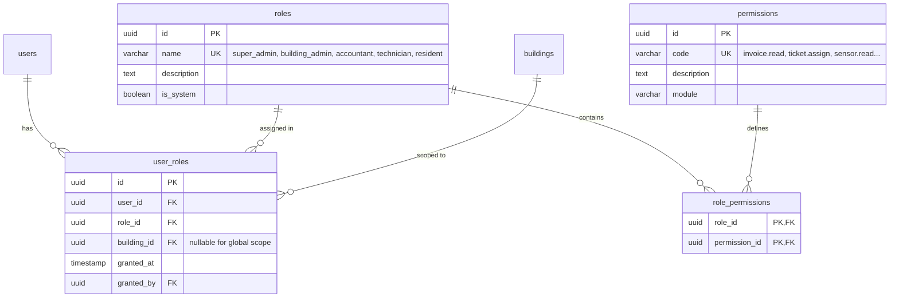

# Phân Quyền Vai Trò (RBAC) & Bảng Điều Hành Vận Hành (Admin Operations Dashboard)
**Smart Building Cloud Platform — Tài Liệu Kiến Trúc & Vận Hành**

---

## 1. Giới Thiệu & Triết Lý Thiết Kế

Hệ thống Smart Building Cloud Platform phục vụ đồng thời nhiều nhóm đối tượng tham gia vận hành và sinh sống trong tòa nhà:
1. **Cư dân (Residents)**: Quản lý thiết bị tiện nghi trong căn hộ, xem hoá đơn sinh hoạt, thanh toán trực tuyến, và gửi yêu cầu sửa chữa.
2. **Kỹ thuật viên (Technicians)**: Tiếp nhận phiếu phân công việc, cập nhật tiến độ xử lý, theo dõi tình trạng thiết bị phần cứng.
3. **Kế toán BQL (Accountants)**: Quản lý hoá đơn, theo dõi công nợ, đối soát giao dịch chuyển khoản, đôn đốc nhắc nợ.
4. **Ban Quản Lý Tòa Nhà (Building Admins)**: Điều hành toàn diện trong phạm vi tòa nhà, phân công phiếu công việc, quản lý cư dân.
5. **Quản Trị Hệ Thống (Super Admins)**: Cấu hình chính sách giá, quản lý đa tòa nhà (multi-tenant), cấp phát và thu hồi vai trò.

### 1.1 Nguyên Tắc Cốt Lõi: Least Privilege (Tối Thiểu Đặc Quyền)
- **Kỹ thuật viên (`technician`)**: Không được xem hoá đơn, lịch sử giao dịch hay số tiền nợ của cư dân (`HTTP 403 Forbidden`).
- **Kế toán (`accountant`)**: Được xem toàn bộ hoá đơn, đối soát và chỉ số tài chính; tuyệt đối không được truy cập dữ liệu telemetric cảm biến thời gian thực (`sensor_readings`) (`HTTP 403 Forbidden`).
- **Cư dân (`resident`)**: Tuyệt đối không bao giờ truy cập được dữ liệu, hoá đơn hay phiếu bảo trì của căn hộ khác qua bất kỳ endpoint nào (IDOR protection — ngăn chặn Insecure Direct Object References).
- **Phân tách nghiệp vụ Admin Dashboard vs Grafana**:
  - **Grafana**: Phục vụ đội ngũ kỹ sư DevOps/Cloud giám sát hạ tầng kỹ thuật (P95 latency, RPS, CPU/RAM, Kafka consumer lag, DB pool usage).
  - **Admin Operations Dashboard**: Phục vụ Ban Quản Lý và Kế toán theo dõi các chỉ số nghiệp vụ thực tế (tỷ lệ thu phí đúng hạn theo tháng, top căn hộ nợ quá hạn, thiết bị cần kiểm tra theo tầng, phiếu việc quá hạn SLA, cơ cấu doanh thu dịch vụ).

---

## 2. Mô Hình Dữ Liệu RBAC Đa Tòa Nhà (Multi-Tenant)

Các quyền hạn và vai trò được lưu trữ độc lập với bảng `users`, hỗ trợ phân quyền theo `(user_id, role_id, building_id)`:



---

## 3. Ma Trận Vai Trò $\times$ Quyền Hạn (Role $\times$ Permission Matrix)

| Mã Quyền Hạn (`permission.code`) | Mô Tả Nghiệp Vụ | `super_admin` | `building_admin` | `accountant` | `technician` | `resident` |
|:---|:---|:---:|:---:|:---:|:---:|:---:|
| `invoice.read` | Xem danh sách và chi tiết hoá đơn tòa nhà | ✅ | ✅ | ✅ | ❌ (403) | ❌ (chỉ căn mình) |
| `invoice.manage` | Tạo, sửa, huỷ, duyệt xác nhận thanh toán thủ công | ✅ | ✅ | ✅ | ❌ | ❌ |
| `sensor.read` | Xem dữ liệu cảm biến telemetric thời gian thực | ✅ | ✅ | ❌ (403) | ✅ | ❌ (chỉ căn mình) |
| `device.read` | Xem danh sách và trạng thái thiết bị | ✅ | ✅ | ❌ | ✅ | ❌ |
| `device.write` | Cấu hình, khởi động lại, bảo trì thiết bị | ✅ | ✅ | ❌ | ❌ | ❌ |
| `ticket.read` | Xem danh sách phiếu yêu cầu sự cố kỹ thuật | ✅ | ✅ | ❌ | ✅ | ❌ (chỉ căn mình) |
| `ticket.create_own` | Tạo phiếu yêu cầu sự cố cho căn hộ cá nhân | ❌ | ❌ | ❌ | ❌ | ✅ |
| `ticket.assign` | Phân công kỹ thuật viên xử lý sự cố | ✅ | ✅ | ❌ | ❌ | ❌ |
| `ticket.status_update` | Kỹ thuật viên cập nhật trạng thái phiếu | ✅ | ✅ | ❌ | ✅ | ❌ |
| `admin.dashboard.read` | Truy cập bảng điều hành vận hành BQL | ✅ | ✅ | ✅ | ❌ (403) | ❌ (403) |
| `user.manage` | Quản trị tài khoản cư dân & gán căn hộ | ✅ | ✅ | ❌ | ❌ | ❌ |
| `role.manage` | Cấp phát và thu hồi vai trò RBAC | ✅ | ❌ | ❌ | ❌ | ❌ |
| `resident.read_own` | Cư dân xem thông tin căn hộ cá nhân | ❌ | ❌ | ❌ | ❌ | ✅ |

---

## 4. Cơ Chế Kiểm Soát Quyền Trong FastAPI

Thay vì hard-code các câu lệnh phân tán như `if user.role == "admin"`, hệ thống sử dụng dependency injection chuẩn mực:

```python
from app.api.deps import require_permission

@router.get("/invoices")
async def list_invoices(
    current_user: Annotated[User, Depends(require_permission("invoice.read"))],
    db: Annotated[AsyncSession, Depends(get_db)],
):
    ...
```

### 4.1 Bảo Mật & An Toàn Thông Tin Khi Trả Lỗi 403
Mọi vi phạm quyền hạn đều trả về thông điệp an toàn, không để lộ cấu trúc bảng, tên quyền kỹ thuật nội bộ hay stack trace:
```json
{
  "detail": "Bạn không có quyền thực hiện thao tác này"
}
```

### 4.2 Kiểm Soát Truy Cập IDOR (Insecure Direct Object References)
Với cư dân truy cập hoá đơn qua `GET /api/v1/invoices/{id}`:
```python
if not can_read_all:
    if not current_user.apartment_id or invoice.apartment_id != current_user.apartment_id:
        raise HTTPException(
            status_code=status.HTTP_403_FORBIDDEN,
            detail="Bạn không có quyền xem hoá đơn này",
        )
```

---

## 5. API Vận Hành & Quản Trị RBAC

### 5.1 Quản Trị Người Dùng & Vai Trò (Super Admin Only)
- `GET /api/v1/admin/users`: Danh sách người dùng kèm các vai trò đã gán và phạm vi tòa nhà.
- `POST /api/v1/admin/users/{id}/roles`: Gán vai trò cho người dùng (kèm `role_id` và `building_id` tuỳ chọn).
- `DELETE /api/v1/admin/users/{id}/roles/{role_id}`: Thu hồi vai trò đã gán.
- `GET /api/v1/admin/roles`: Danh mục các vai trò hệ thống và ma trận quyền hạn.

### 5.2 Bảng Điều Hành Nghiệp Vụ BQL (`admin.dashboard.read`)
- `GET /api/v1/admin/dashboard/overview`: Tổng quan tỷ lệ lấp đầy, số hoá đơn chưa thanh toán, tổng nợ, phiếu việc mở, thiết bị cần kiểm tra, doanh thu theo dịch vụ.
- `GET /api/v1/admin/dashboard/collection-rate`: Tỷ lệ thu nợ và tỷ lệ nộp đúng hạn theo tháng (so sánh với tháng trước).
- `GET /api/v1/admin/dashboard/overdue-apartments`: Top các căn hộ nợ tiền quá hạn chót, số ngày trễ, số tiền nợ.
- `GET /api/v1/admin/dashboard/device-health`: Tình trạng thiết bị ngoại tuyến được tổng hợp theo từng tầng (ngôn ngữ tự nhiên, ví dụ: "Tầng 2 có 1 thiết bị cần kiểm tra").

---

## 6. Kiểm Thử Bảo Mật Tự Động (Security Test Suite)

Toàn bộ các ràng buộc đặc quyền được kiểm thử tự động trong `backend/tests/test_rbac_security.py`:
1. `test_least_privilege_technician_cannot_view_invoices` (Assert HTTP 403)
2. `test_least_privilege_accountant_cannot_view_sensor_readings` (Assert HTTP 403)
3. `test_least_privilege_accountant_can_view_invoices_and_collection_rate` (Assert HTTP 200)
4. `test_idor_protection_resident_cannot_access_other_invoice` (Assert HTTP 403)
5. `test_idor_protection_resident_can_access_own_invoice` (Assert HTTP 200)
6. `test_resident_cannot_access_admin_dashboard` (Assert HTTP 403)
7. `test_super_admin_dynamic_role_grant_and_revoke` (Assert HTTP 201 -> role active -> HTTP 200 -> role revoked)
8. `test_admin_dashboard_endpoints_data_accuracy` (Kiểm tra tính chính xác của 4 endpoint dashboard)
